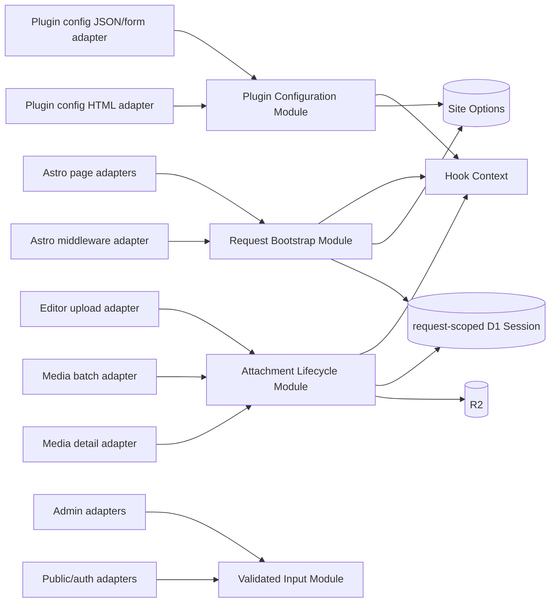

# Project Hardening Design

## 1. Design goals

This design fixes the review findings while increasing Depth at four seams. Callers should not need to understand secret restoration, R2/row deletion ordering, request initialization ordering, or endpoint-specific parsing rules. Those invariants gain Locality inside deep Modules and are tested through the same Interface used by production adapters.

The design preserves Typecho-compatible tables, public URLs, Hook names, the current theme system, and the existing admin visual language.

## 2. Module map



## 3. Plugin Configuration Module

### 3.1 Seam and Interface

Create `src/lib/plugin-config.ts` with two public operations:

```ts
getPluginConfigurationView(options, pluginId): PluginConfigurationView
savePluginConfiguration(auth, input): Promise<PluginConfigurationSaveResult>
```

`PluginConfigurationView` contains the manifest fields and masked values only. `PluginConfigurationSaveResult` contains success metadata and masked values; it never contains stored plaintext secrets.

The Implementation owns:

- top-level and repeatable nested secret masking;
- sentinel restoration from the previous configuration;
- manifest-key allowlisting and defaults;
- active-plugin checks;
- `plugin:config:beforeSave` and its timeout;
- one `setOption()` call and site-cache purge;
- stable domain errors that adapters translate to HTML or JSON.

### 3.2 Adapters

- The HTML page becomes read-only rendering. Its form submits to the canonical endpoint using `application/x-www-form-urlencoded`.
- The endpoint accepts JSON and form submissions, always enters through `requireAdminAction()`, and returns JSON or a safe 303 redirect according to the submitted content type.
- The HTML adapter never receives a raw configuration object.

This passes the deletion test: deleting the Module would re-spread masking, sentinel restoration, plugin validation, and cache invalidation into both adapters.

## 4. Password and session lifecycle

- Raise `PASSWORD_MIN_LENGTH` from 6 to 12 and keep every server and HTML constraint sourced from that constant.
- A profile password change requires `currentPassword`; the Implementation verifies it before accepting `password` and `passwordConfirm`.
- The password hash and a new cryptographically random `authCode` are written together.
- A successful profile password change clears the current auth Cookies and redirects to login, making the invalidation visible rather than leaving the user on a page with a now-invalid Cookie.
- Reset-password parsing validates `confirm` before token lookup/update, so mismatch does not consume the token.

Compatibility note: existing password hashes and existing signed-in sessions remain valid until a password-changing event. Login-time PBKDF2 rehash behavior is unchanged.

## 5. Atomic login rate limiting

Replace the read/modify/write sequence with one SQLite UPSERT:

- insert a first failure when the IP is absent;
- on conflict, use `CASE` expressions against the existing row and submitted `now`;
- reset the window to one failure when expired;
- increment in-window failures atomically;
- compute `bannedUntil` from the same resulting count.

The statement remains compatible with D1 and the libSQL test Adapter. A concurrent regression test launches failures together and asserts the stored count and ban expiry.

## 6. Request-scoped D1 and Request Bootstrap Module

### 6.1 D1 lifecycle

`getDb(binding)` stops caching Drizzle instances backed by `D1DatabaseSession`. Each call creates a new `first-unconstrained` Session when available. The Request Core then reuses that database handle everywhere in the same request.

Cross-request Site Option caching remains in the Cache API. The in-memory snapshot becomes request-local as a consequence; this trades a small isolate-local optimization for correct Session ownership. No bookmark is transferred between unrelated users.

This follows Cloudflare's Session model, where a bookmark represents sequential consistency for one logical session: <https://developers.cloudflare.com/d1/best-practices/read-replication/>.

### 6.2 Bootstrap seam

Create `src/lib/request-bootstrap.ts` with three public operations:

```ts
resolveRequestTarget(request, locals): RequestTarget
bootstrapRequestCore(request, locals): Promise<BootstrapResult>
finalizeRequestResponse(response, finalization): Promise<Response>
```

- `resolveRequestTarget` parses `/page/N/`, stores a bounded page number, and returns the internal route target without ending middleware execution.
- `bootstrapRequestCore` performs database readiness, installation status, secret bootstrap, Site Option loading, plugin activation, and Request Core installation in the required order.
- `finalizeRequestResponse` applies plugin-aware security headers and performs an optional tracked cache write.

Middleware retains route matching and permalink lookup because those are routing policy, but all early responses and the final route response cross the finalization Interface. The original URL remains the edge-cache key; the effective path is used for route matching; plugin route metadata receives both original and effective paths.

## 7. Attachment Lifecycle Module

Create `src/lib/attachment-lifecycle.ts`:

```ts
deleteAttachments(context, cids): Promise<AttachmentDeletionResult>
```

The Implementation:

1. normalizes and deduplicates identifiers;
2. loads attachment rows once;
3. authorizes each row using current actor permission and `authorId`;
4. parses attachment metadata;
5. attempts R2 deletions concurrently with `Promise.allSettled()`;
6. records structured orphan diagnostics for malformed metadata or R2 failures;
7. invokes `upload:delete` once per authorized attachment;
8. deletes authorized rows with one set-based D1 statement;
9. returns deleted, forbidden, missing, and orphan-risk identifiers.

Failure policy: R2 failure does not block removal of the database record, matching current cleanup behavior. It must never be silent. `doHook()` already isolates call-Hook failures, so plugin failures do not make deletion state indeterminate.

Single-item and batch adapters differ only in response shape and redirect behavior.

## 8. Comment Ownership

- Comment list and profile/dashboard comment statistics join `typecho_contents` and filter on `contents.authorId` for non-administrators.
- Comment status totals shown to non-administrators use the same ownership condition instead of global totals.
- `comments.ownerId` remains stored for PHP Typecho compatibility but is excluded from authorization Interfaces.
- Existing moderation helpers remain the canonical permission Implementation.

## 9. Validated Input Module

Create `src/lib/input.ts` with a small, high-leverage Interface:

```ts
readBoundedFormData(request, maxBytes): Promise<FormData>
parsePageNumber(value, options?): number
normalizeSlug(value, fallback?): string
withQueryParams(path, values): string
```

The Implementation hides Content-Length parsing, 413 errors, finite-integer checks, clamping, Unicode-safe slug normalization, empty-result fallback, and omission of empty query parameters.

Endpoint limits:

| Request class | Maximum declared body |
|---|---:|
| Login, logout-adjacent auth, password reset | 16 KiB |
| Registration, forgot-password, public comment | 64 KiB |
| Admin non-upload forms and plugin configuration | 256 KiB |
| Upload multipart request | 11 MiB, with a 10 MiB file limit |

Form and JSON bodies are read through a bounded stream before parsing, so missing or dishonest `Content-Length` headers cannot bypass the byte limit. Field-level validation still runs after parsing. Upload writes `file.stream()` directly to R2 rather than making a second `ArrayBuffer` copy. R2 accepts a `ReadableStream` body through the Workers binding: <https://developers.cloudflare.com/r2/api/workers/workers-api-reference/>.

Domain-specific validation remains with the domain Module:

- `src/lib/options-input.ts` owns Site Option schemas, cross-field conversion, checkbox defaults, and Permalink Pattern validation;
- content/meta persistence owns uniqueness resolution after `normalizeSlug()`;
- comment/content write paths own post-Filter row validation.

This avoids creating shallow one-function Modules for every field.

## 10. Site Options and slugs

### 10.1 Site Option schema

The Site Option parser builds one `Record<string, string>` and calls `setOptionsBatch()` once. Initial ranges:

- page/list/comment sizes: 1–100;
- feed items: 5–50;
- nesting levels: 1–20;
- editor height: 100–2000;
- login window: 10–86400 seconds;
- login failures: 1–100;
- login ban: 10–86400 seconds;
- timezone: -43200–50400 seconds;
- boolean values: exactly `0` or `1`;
- enum values: explicit allowlists;
- `siteUrl`: normalized HTTP(S) origin without credentials, query, or fragment;
- Permalink Patterns: accepted only when `compilePermalinkPattern()` succeeds for their kind.

Validation failure persists nothing and returns 400. Cache version changes exactly once.

### 10.2 Slug namespaces

- Content slugs use the existing unique content resolver after normalization.
- Category and tag slugs resolve uniqueness within their own metadata type using deterministic numeric suffixes.
- Attachment slug edits normalize and resolve through the same content slug Implementation.
- No new database uniqueness migration is required, avoiding rollout failure on existing duplicate metadata; application validation prevents new duplicates.
- Install `.returning()` failures throw explicit installation errors; no identifier fallback remains.

## 11. Write Filter invariants

### 11.1 Comment Filter

The documented mutable fields remain `author`, `mail`, `url`, `text`, `status`, and `_rejected`. The final validator:

- restores protected `cid`, `created`, `authorId`, `ownerId`, `ip`, `agent`, `type`, and `parent` from the pre-Filter record;
- validates mutable field types and existing length limits;
- increments the comment counter using the final protected `cid` and validated status.

### 11.2 Content Filters

The documented mutable fields remain title, slug, created, text, order, template, status, password, and allow flags. The final validator:

- restores protected `authorId` and content `type` derived from the authenticated operation;
- validates enum, number, string, and length invariants;
- normalizes the returned slug before uniqueness resolution.

Plugin documentation and Hook reference pages are updated to describe these contracts.

## 12. Admin list behavior

- Admin post listing accepts a bounded `uid`; non-administrators always remain scoped to themselves regardless of the query.
- Post and comment links are generated with `withQueryParams()` so status, keywords, category, cid, uid, and page survive relevant navigation.
- Search text is trimmed and capped before entering LIKE expressions.
- All offsets use the already bounded page value.

## 13. UI design specification

### Purpose statement

The admin interface is a dense publishing tool used repeatedly by authors and administrators. This change improves operability for keyboard, screen-reader, and mobile users without introducing a visual redesign or making existing workflows unfamiliar.

### Aesthetic direction

Industrial/utilitarian, preserving the established Typecho administration language and compact information density.

### Color palette

- Charcoal navigation: `#292D33`
- Canvas: `#F6F6F3`
- Primary action/link: `#467B96`
- Destructive action: `#B94A48`
- Focus outline: `#E47E00`

### Typography

The existing Typecho font stack is retained for compatibility. This is a narrow project-design-system override of the UI skill's default typography guidance; changing typography is explicitly outside scope.

### Layout strategy

Retain the asymmetric utility structure: persistent dark navigation edge, dense content tables, and contextual action groups. No centered-card redesign or new decorative layout is introduced.

### Interaction changes

- Remove `maximum-scale=1` from authentication pages.
- Add `aria-controls`, `aria-haspopup`, and synchronized `aria-expanded` to navigation/dropdown toggles.
- Support Enter/Space activation, Escape dismissal, outside-click dismissal, and return focus to the controlling button.
- Add a consistent high-contrast `:focus-visible` outline without changing hover styling.
- Use existing caret CSS; no new icon dependency is required.

Target platform: Web, Astro SSR with progressively enhanced client-side JavaScript.

## 14. Workers configuration and diagnostics

- Generate `CloudflareEnv` and binding types with `wrangler types`; retain only Astro locals and virtual-module declarations in the hand-authored environment file.
- Add a repeatable `types:workers` script and document running it after binding changes.
- Enable logs and low-rate traces in `wrangler.toml.example`; keep secret values out of configuration.
- Changed diagnostics use JSON objects with stable fields such as `event`, `cid`, `path`, and sanitized error text.
- Add type-aware ESLint configuration with `@typescript-eslint/no-floating-promises` and a `lint` script. Existing generated/build output is excluded.

Cloudflare recommends generated binding types, tracked Promises, structured logs, and sampled tracing: <https://developers.cloudflare.com/workers/best-practices/workers-best-practices/>.

## 15. Verification strategy

### Module tests

- Plugin Configuration: top-level/nested masking, sentinel restore, omitted defaults, plugin validation errors, no secret in results.
- Attachment Lifecycle: authorization, malformed metadata, R2 failure, Hook invocation, set-based deletion.
- Request Bootstrap: pagination target without early exit, install/bootstrap errors, security finalization, request-level database reuse.
- Validated Input: body limits, page edge cases, query preservation, Unicode and unsafe-character slugs.
- Site Options: valid batch, every range/enum failure, invalid origins and patterns, checkbox semantics.

### Integration tests

- Old Session rejected after profile password change.
- Concurrent login failures reach the exact threshold.
- Reassigned comment visibility in rendered admin queries.
- HTML and JSON plugin configuration share security and masking behavior.
- All attachment deletion adapters produce equivalent side effects.
- `/page/N/` executes plugin routing, cache policy, and plugin-aware CSP.
- Admin user/post and filtered pagination links retain scope.
- Reset confirmation mismatch preserves the reset request.
- Filter attempts to change protected fields are neutralized or rejected.

### Final checks

```text
pnpm run lint
pnpm run test
pnpm run typecheck
pnpm run build
```

## 16. Rollout and compatibility

- No database migration is planned.
- The password minimum applies only when a password is newly set or changed; existing six-character hashes continue to authenticate.
- Plugin Hook names remain unchanged; mutable-field documentation becomes narrower and explicit.
- Metadata duplicates already present remain readable; new writes resolve conflicts.
- Attachment orphan diagnostics enable later operator reconciliation without blocking administrative cleanup.
